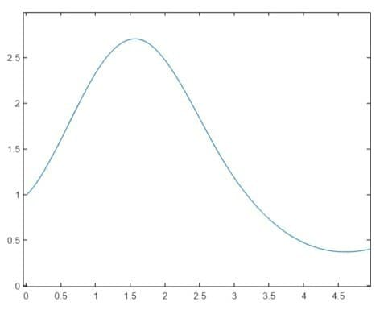

# splinecloud-matlab
SplineCloud client library for MATLAB

## Uses:
 - [NURBS Toolbox by D.M. Spink](https://www.mathworks.com/matlabcentral/fileexchange/26390-nurbs-toolbox-by-d-m-spink)
 - [Curve intersections](https://www.mathworks.com/matlabcentral/fileexchange/22441-curve-intersections)

## Example
```matlab
clear variables; clear all; clc;

addpath(genpath('splinecloud-matlab'));

curveId = 'spl_BUDRcYh1Mbvy';

spline = fetchCurve(curveId);

[ctrlPoints, knots] = extractNurbsParams(spline);

nurbs = nrbmak(ctrlPoints, knots);

xPoints = linspace(0, 5, 100);
xLength = length(xPoints);
yPoints = zeros(1, xLength);

for i = 1:xLength
    yPoints(i) = getYByX(nurbs, xPoints(i));
end

plot(xPoints, yPoints);
```

